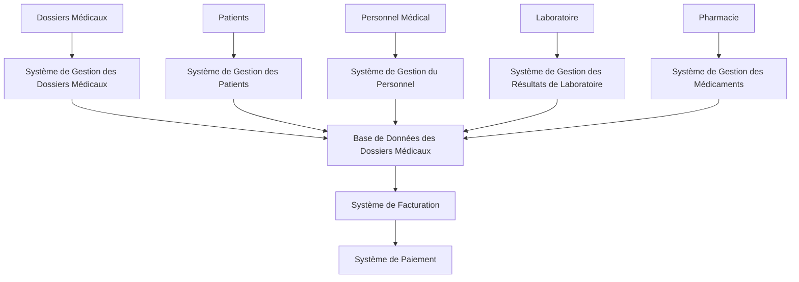

## Modélisation de l'Architecture d'un SI Hôpital

**Diagramme de Flux de Données (DFD)**



**Explication du DFD**

Ce diagramme de flux de données simplifié représente les flux d'informations principaux dans un système d'information hospitalier (SIH). Les entités externes (acteurs) et les systèmes internes sont représentés par des rectangles. Les flèches indiquent le flux des données entre les entités.

* **Dossiers Médicaux:** Stockent les informations médicales des patients.
* **Système de Gestion des Dossiers Médicaux:** Gère et consulte les dossiers médicaux.
* **Base de Données des Dossiers Médicaux:** Stocke les données des dossiers médicaux.
* **Patients:** Fournissent des informations personnelles et médicales.
* **Système de Gestion des Patients:** Gère les informations des patients et planifie les rendez-vous.
* **Personnel Médical:** Accède et met à jour les dossiers médicaux et prescrit des traitements.
* **Système de Gestion du Personnel:** Gère les informations du personnel médical et planifie les horaires.
* **Laboratoire:** Effectue des analyses et transmet les résultats.
* **Système de Gestion des Résultats de Laboratoire:** Gère et consulte les résultats de laboratoire.
* **Pharmacie:** Fournit des médicaments et gère les stocks.
* **Système de Gestion des Médicaments:** Gère les stocks de médicaments et les ordonnances.
* **Système de Facturation:** Génère les factures pour les services médicaux.
* **Système de Paiement:** Traite les paiements des patients.

Ce DFD fournit une vue d'ensemble simplifiée des flux de données dans un SIH. Des diagrammes plus détaillés peuvent être créés pour chaque sous-système, illustrant les interactions internes et les processus spécifiques.

**Diagramme de Classes UML**

```mermaid
classDiagram
Patient {
  id: int
  nom: String
  prenom: String
  dateNaissance: Date
  adresse: String
  numeroSecuriteSociale: String
  dossiersMedicaux: Dossier[]
}

Dossier {
  id: int
  patient: Patient
  dateOuverture: Date
  dateFermeture: Date
  historiqueConsultations: Consultation[]
  historiqueAnalyses: Analyse[]
  historiquePrescriptions: Prescription[]
}

Consultation {
  id: int
  dossier: Dossier
  dateConsultation: Date
  medecin: Medecin
  diagnostic: String
  traitement: String
}

Medecin {
  id: int
  nom: String
  prenom: String
  specialite: String
  consultations: Consultation[]
}

Analyse {
  id: int
  dossier: Dossier
  dateAnalyse: Date
  typeAnalyse: String
  resultat: String
}

Prescription {
  id: int
  dossier: Dossier
  datePrescription: Date
  medecin: Medecin
  medicament: Medicament
  quantite: int
  posologie: String
}

Medicament {
  id: int
  nom: String
  principesActifs: String[]
  indication: String
  contreIndications: String[]
}
