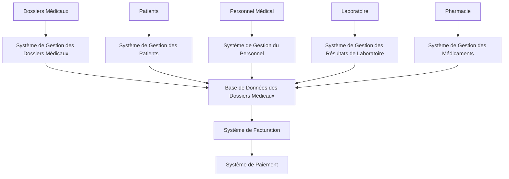

## Modélisation de l'Architecture d'un SI Hôpital

**Diagramme de Flux de Données (DFD)**

```mermaid
graph TD
A[Dossiers Médicaux] --> B[Système de Gestion des Dossiers Médicaux]
B --> C[Base de Données des Dossiers Médicaux]
D[Patients] --> E[Système de Gestion des Patients]
E --> C
F[Personnel Médical] --> G[Système de Gestion du Personnel]
G --> C
H[Laboratoire] --> I[Système de Gestion des Résultats de Laboratoire]
I --> C
J[Pharmacie] --> K[Système de Gestion des Médicaments]
K --> C
C --> L[Système de Facturation]
L --> M[Système de Paiement]
```
